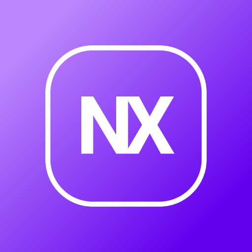

# Notx - A Flutter Note-Taking Application

Notx is a simple and intuitive note-taking application built with Flutter. An easy way to manage ideas or any information you need to remember.

<p align="center">
   
</p>

https://github.com/user-attachments/assets/47fe1a99-80e3-49ef-a700-e9672a6b31c4

## Features

- **Create Notes**: Add new notes with a title and content.
- **Edit Notes**: Update or modify existing notes.
- **Delete Notes**: Remove notes when they are no longer needed.
- **View Notes**: Display all notes in a list format for easy navigation, tap on a note to see it fully.
- **Theming**: Choose between light and dark mode as you see fit.
- **Persistent Storage**: Notes are stored locally using SQLite, as well as themes, which are saved locally using Shared Preferences.

## Prerequisites

- Install [Flutter SDK](https://flutter.dev/docs/get-started/install) on your machine.
- Install [Dart SDK](https://dart.dev/get-dart) if not included with Flutter installation.

## Version Used For Development
- **Flutter**: 3.27.1
- **Dart**: 3.6.0

## Installation

To get started with the app, follow the steps below:

1. Clone the repository:
   ```bash
   git clone https://github.com/guilhermedasilvavieira/notx.git
   ```

2. Navigate into the project directory:
   ```bash
   cd notx
   ```

3. Install dependencies:
   ```bash
   flutter pub get
   ```

4. Run the app on your device or simulator:
   ```bash
   flutter run --release
   ```

## Dependencies

- **Flutter**: The framework used for building the app.
- **flutter_bloc**: State management.
- **equatable**: Instances comparison.
- **intl**: DateTime formating and parsing 
- **path**: Join directory paths
- **path_provider**: Get platform specific paths such as documents
- **sqflite**: Local database used to persist notes.
- **shared_preferences**: Simple data persistance used for theming
- **flutter_launcher_icons**: Cross platform app icon

## Supported Platforms

- Android
- iOS
- MacOS
- Windows
- Linux

## License

This project is licensed under the MIT License - see the [LICENSE](LICENSE.md) file for details.

## Contributing

Feel free to open an issue or submit a pull request if you would like to contribute to the development of Notx.

## Contact

If you have any questions or suggestions, feel free to reach out to my [LinkedIn](https://www.linkedin.com/in/guilherme-da-silva-vieira/).
